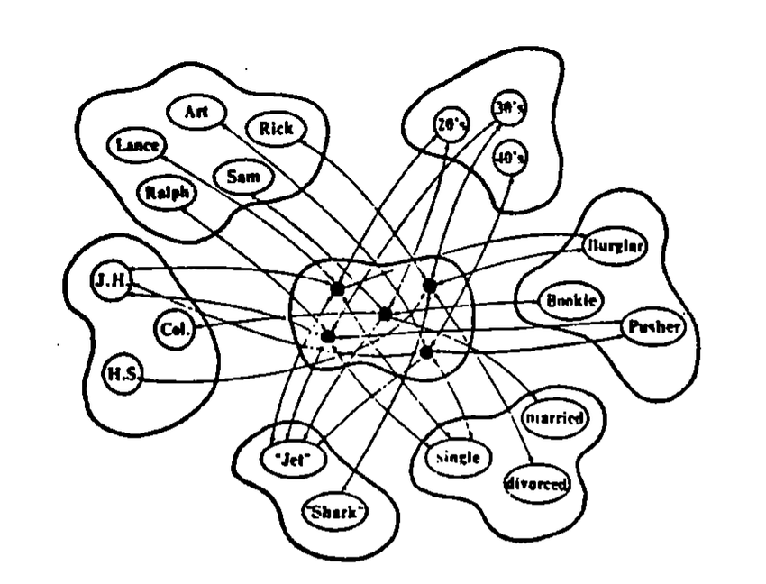

# In progress... 


# Dynamic Associative Networks: An Interactive Model

[](https://colab.research.google.com/github/EpicormicSprout/DanJetShark/blob/main/DANjetShark.ipynb)

🌐 **Live Demo**: [epicormicsprout.github.io/DanJetShark](https://epicormicsprout.github.io/DanJetShark/)

---

This project provides an interactive, browser-based implementation of a **Dynamic Associative Network (DAN)**. It demonstrates the cognitive model proposed by Anthony F. Beavers, using the classic *"Jets and Sharks"* dataset from James McClelland and David Rumelhart's 1981 work.

The model showcases how a network can perform context-sensitive inference to predict associations, moving beyond simple data retrieval.

---

## 🚀 Demos & Usage

### 💻 Live Interactive Demo (Recommended)
For the quickest way to explore the model, try the web demo — no installation needed:

👉 [Click here to view the live demo](https://epicormicsprout.github.io/DanJetShark/)

### 🧪 Google Colab Notebook (Python Version)
Want to run the Python code, inspect variables, and see how `ipywidgets` and `plotly` work?

👉 [Open in Google Colab](https://colab.research.google.com/github/EpicormicSprout/DanJetShark/blob/main/DANjetShark.ipynb)

---

## 🧠 The Model: From McClelland to Beavers

This project sits at the intersection of two key ideas in cognitive science:

### McClelland's IAC Model (1981)
Their original *"Jets and Sharks"* model showed that a simple network could store specifics (like individual traits) and still retrieve generalizations about a group — all without rules.

<p align="center">
  
  <br />
  <em>"Figure 1. The representation of several of the individuals listed in Table 1." -McClelland 1981</em>
</p>

### Beavers' DAN Model (2010)
Beavers advanced this with a nonlinear, two-phase weighting system. The DAN doesn't just retrieve — it makes **dynamic inferences** by adjusting weights at query time based on data structure.

This implementation brings Beavers’ model to life.

---

## 🔄 How it Works: The Two-Phase Inference Cycle

When you select properties and run inference, the model executes two steps:

### Phase 1: Properties → Objects (Activation)
- **Diffusion**: Measures how unique each selected property is (rarer = stronger signal).
- **Object Excitation**: Nodes (people) score higher if they match rare properties.
- **Normalization**: Their score is scaled by their own "ideal" match value.

### Phase 2: Objects → Properties (Inference)
- **Feedback Loop**: Activated people boost related properties (Hebbian-style).
- **Property Redefinition**: Properties collect these scores.
- **Prediction**: The top new properties (excluding your original query) are shown as predictions.

---

## 🔍 Key Concepts & Model Insights

### 1. Stateless Inference vs. Hebbian Learning
This model restarts fresh on each run — it **does not learn or evolve** over time. It mimics Hebbian logic within a single query cycle.

### 2. Why Some Activation Weights > 1.0
Weights are **ratios**, not probabilities:
```text
Object Weight = Current Activation / Ideal Activation
```
## 📚 References

Beavers, A. F. (2010). *Typicality Effects and Resilience in Evolving Dynamic Associative Networks*.  
In *Complex Adaptive Systems – Resilience, Robustness, and Evolvability: Papers from the AAAI Fall Symposium (FS-10-03)*.  
[https://cdn.aaai.org/ocs/2321/2321-9515-1-PB.pdf](https://cdn.aaai.org/ocs/2321/2321-9515-1-PB.pdf)

McClelland, J. L., & Rumelhart, D. E. (1981). *Retrieving General and Specific Information from Stored Knowledge of Specifics*.  
University of California eScholarship Repository.  
[https://escholarship.org/uc/item/9qr1n7jv](https://escholarship.org/uc/item/9qr1n7jv)
